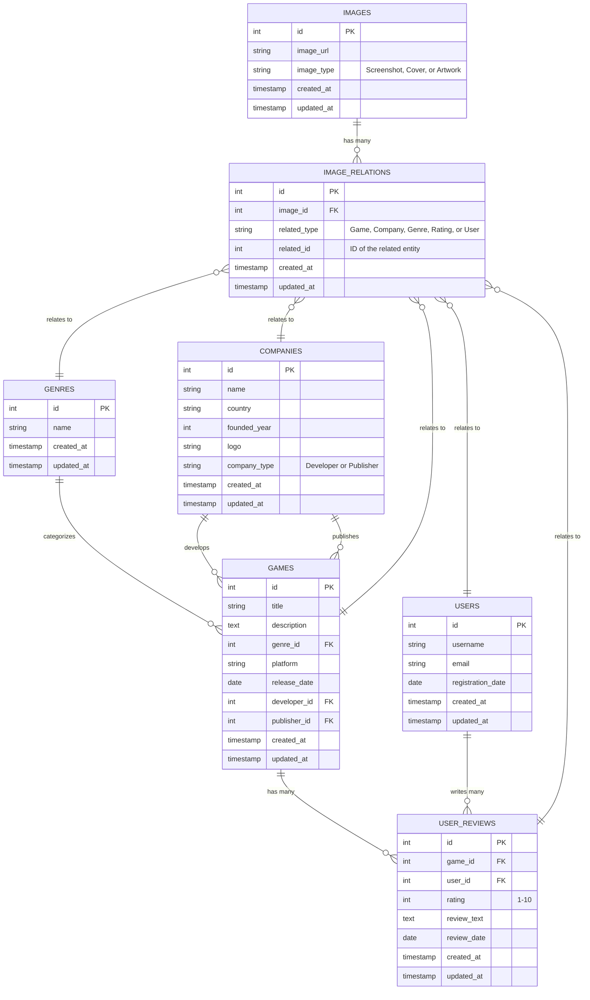

# Database Schema - Game API

## Entity Relationship Diagram

## Table Descriptions

### Games
Central table containing video game information. Each game belongs to one genre and is associated with two companies (developer and publisher).

### Companies
Stores both game developers and publishers. Distinguished by the `company_type` field.

### Genres
Game categories (Action, RPG, Strategy, etc.). Each game belongs to exactly one genre.

### Users
Registered users who can write reviews for games.

### User Reviews
Contains ratings and text reviews. Links users to games with their feedback.

### Images
Stores image URLs and types (screenshots, covers, artwork).

### Image Relations
Polymorphic association table that allows images to be linked to any entity type (games, companies, genres, reviews, or users).

## Relationships

1. **Games → Genre**: Many-to-One (each game has one genre)
2. **Games → Company (Developer)**: Many-to-One (each game has one developer)
3. **Games → Company (Publisher)**: Many-to-One (each game has one publisher)
4. **Games → User Reviews**: One-to-Many (games can have multiple reviews)
5. **Users → User Reviews**: One-to-Many (users can write multiple reviews)
6. **Images → Image Relations**: One-to-Many (images can have multiple relations)
7. **Image Relations → Any Entity**: Polymorphic Many-to-One (can relate to any table)

## Key Constraints

- `games.genre_id` → `genres.id`
- `games.developer_id` → `companies.id`
- `games.publisher_id` → `companies.id`
- `user_reviews.game_id` → `games.id`
- `user_reviews.user_id` → `users.id`
- `image_relations.image_id` → `images.id`
- `image_relations.related_id` → Polymorphic (depends on `related_type`)

## Indexes

Primary indexes exist on all `id` columns. Additional indexes should be created on:
- Foreign key columns (`genre_id`, `developer_id`, `publisher_id`, `game_id`, `user_id`, `image_id`)
- `image_relations.related_type` and `image_relations.related_id` (composite index)
- `games.title` for search functionality
- `companies.name` for search functionality