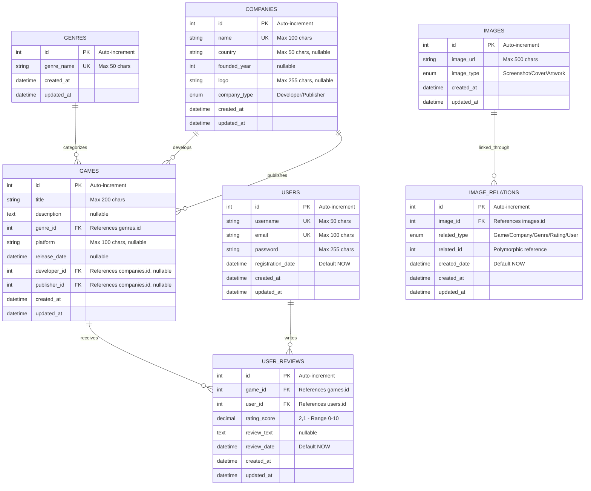

# Game API - Entity Relationship Diagram

## Database Schema

## Relationship Details

### Primary Relationships

1. **GENRES → GAMES** (One-to-Many)
   - One genre can categorize many games
   - Each game must have exactly one genre
   - Foreign Key: `games.genre_id` → `genres.id`
   - On Update: CASCADE
   - On Delete: RESTRICT

2. **COMPANIES → GAMES (Developer)** (One-to-Many)
   - One company can develop many games
   - Each game can have one developer (nullable)
   - Foreign Key: `games.developer_id` → `companies.id`
   - On Update: CASCADE
   - On Delete: SET NULL

3. **COMPANIES → GAMES (Publisher)** (One-to-Many)
   - One company can publish many games
   - Each game can have one publisher (nullable)
   - Foreign Key: `games.publisher_id` → `companies.id`
   - On Update: CASCADE
   - On Delete: SET NULL

4. **GAMES → USER_REVIEWS** (One-to-Many)
   - One game can have many user reviews
   - Each review belongs to exactly one game
   - Foreign Key: `user_reviews.game_id` → `games.id`
   - On Update: CASCADE
   - On Delete: CASCADE

5. **USERS → USER_REVIEWS** (One-to-Many)
   - One user can write many reviews
   - Each review is written by exactly one user
   - Foreign Key: `user_reviews.user_id` → `users.id`
   - On Update: CASCADE
   - On Delete: CASCADE

6. **IMAGES → IMAGE_RELATIONS** (One-to-Many)
   - One image can be linked to multiple entities
   - Each relation references exactly one image
   - Foreign Key: `image_relations.image_id` → `images.id`
   - On Update: CASCADE
   - On Delete: CASCADE

### Polymorphic Relationship

**IMAGE_RELATIONS** implements a polymorphic relationship pattern:
- `related_type` specifies the entity type (Game, Company, Genre, Rating, or User)
- `related_id` stores the ID of the related entity
- This allows images to be associated with any entity type through a single junction table

## Indexes

### GAMES
- `genre_id` - Foreign key lookup
- `developer_id` - Foreign key lookup
- `publisher_id` - Foreign key lookup
- `release_date` - Date-based queries

### USER_REVIEWS
- `game_id` - Foreign key lookup
- `user_id` - Foreign key lookup
- `(game_id, user_id)` - UNIQUE constraint (one review per user per game)

### IMAGE_RELATIONS
- `image_id` - Foreign key lookup
- `(related_type, related_id)` - Polymorphic relationship lookup

## Constraints

### Unique Constraints
- `genres.genre_name` - Unique genre names
- `companies.name` - Unique company names
- `users.username` - Unique usernames
- `users.email` - Unique email addresses
- `user_reviews.(game_id, user_id)` - One review per user per game

### Enums
- `companies.company_type`: 'Developer' | 'Publisher'
- `images.image_type`: 'Screenshot' | 'Cover' | 'Artwork'
- `image_relations.related_type`: 'Game' | 'Company' | 'Genre' | 'Rating' | 'User'

### Data Validation
- `user_reviews.rating_score`: DECIMAL(2,1) with min 0, max 10
